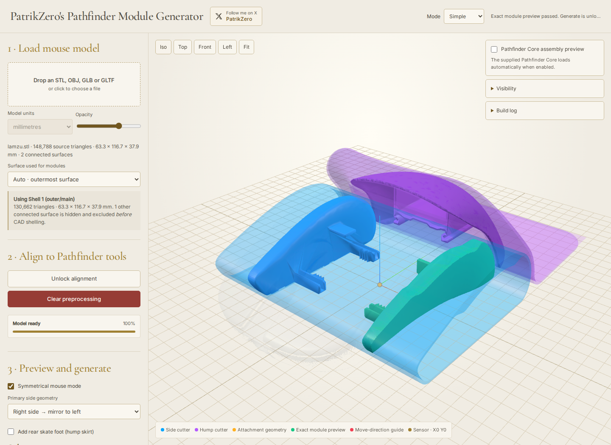

# PatrikZero's Pathfinder Module Generator

Turn a mouse model into printable Pathfinder side and hump modules, directly in your browser.

## Quick start

1. **Import** your mouse STL, OBJ, GLB or GLTF.
2. **Align** it with the Pathfinder tools. The X/Y origin dot marks the sensor position. Click **Preprocess mouse** when ready; alignment locks automatically.
3. **Customize**: optionally enable symmetrical sides, the rear skate foot, or side grip recesses. Click **Refresh Preview** after changing settings and check the result.
4. **Export**: under **Outputs**, click **Generate Printable STLs**, then download your modules. For grips, download the A4 templates and print at **100% / actual size**; check the printed ruler before cutting.

Use **Advanced** mode for extra controls. Read any fit or grip warnings before printing.

To run locally: `python3 server.py`, then open <http://localhost:8000>. Internet access is required for the CAD libraries. Vercel deployment is configured automatically via `vercel.json`.
